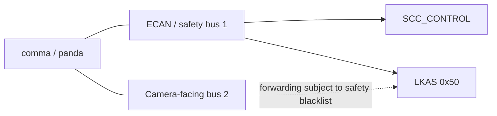

# GV70 CAN Topology

## Confirmed software mapping

For `GENESIS_GV70_2022_2_5T_HDA2`, OpenDBC sets `CANFD_RADAR_SCC | CANFD_CAMERA_SCC`. The helper `canfd_camera_scc_uses_ecan()` is true only for that fingerprint with both flags. In that case, `SCC_CONTROL` is parsed from ECAN rather than the camera parser, and the extended radar interface also selects ECAN.

The local OpenDBC commit `b1867e52` adds a safety regression configuration combining `CANFD_LKA_STEER_MSG | CAMERA_SCC`. Its test model uses:

- powertrain/ECAN safety bus: 1
- SCC safety bus: 1
- LKAS steering message: `0x50`
- cruise buttons TX bus: 1 (inherited from the base class)
- camera forwarding/blacklist bus: 2 for `0x50` and `0x2A4`

This is a software/test mapping, not a complete physical wiring diagram. Connector pins, all ECUs, termination, and observed on-vehicle bus traffic remain undocumented and must be derived from hardware documentation or timestamped logs.
